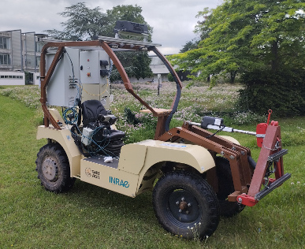
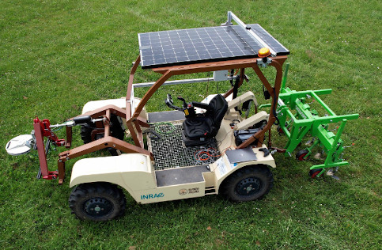
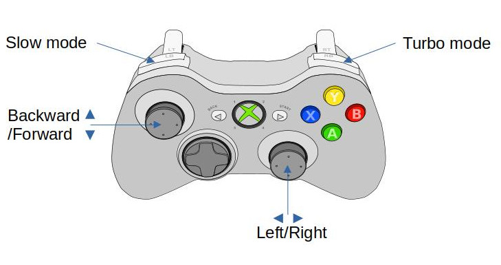
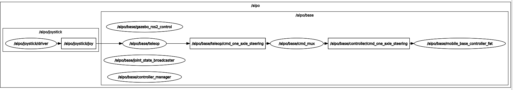

# alpo_bringup #

## 1 Launch files ##

The alpo_bringup package provides a suite of launch files enabling both manual and automated control of Alpo robots, either in real-time or in simulation, including their lifting systems. Two robot models are supported (see figure below): the Alpo POM, also referred to as Alpo Slim, and the Alpo 4x4, also known as Alpo Fat. The Alpo Slim model is equipped with a single front lifting system and two rear driving wheels, while the Alpo Fat model features two lifting systems, one at the front and one at the rear, along with four driving wheels.

|  |  |
| ---------------------------------------- | --------------------------------------- |

### 1.1 Base launch file ###

The **alpo_base.launch.py** file, located in the launch directory, is responsible for starting the controller manager, the robot's controller, and a command multiplexer. The configuration of the controller manager and the robot controller are defined in the **controller_manager.yaml** and **mobile_base_controller.yaml** files, respectively, which are located in the config directory.

By default, **MobileBaseController2FWS4WD** and **MobileBaseController2FWS2RWD** controllers are used to control the 4WD (fat) and 2WD (slim) Alpo robots, respectively. These two controllers are provided by the **romea_mobile_base_controller** package. 

You can launch these nodes via command line:

```console
ros2 launch alpo_bringup alpo_base_launch.py mode:=simulation robot_namespace:=alpo robot_model:=fat base_name:=base
```

where:
- ***mode*** (choices: ***simulation*** or ***live***) defines the demonstration mode.  
- ***robot_model*** (choices: ***fat*** or ***slim***) defines the robot model, with `fat` for 4WD Alpo and `slim` for 2WD Alpo.
- ***robot_namespace*** (default: ***alpo***) sets the main ROS namespace where all Alpo nodes are launched. 
- ***base_name*** (default: ***base***) sets the ROS sub-namespace in which controller nodes are launched
`

### 1.2 Teleop launch file ###

The **alpo_teleop.launch.py** file, located in the launch directory, is used to execute the **one_axle_steering_teleop_node** provided by the **romea_teleop_drivers** package to control the motion of the Alpo robot. You can launch the teleop node via the command line:

```console
ros2 launch alpo_bringup alpo_teleop.launch.py robot_model:=fat joystick_type:=xbox joystick_driver:=joy joystic_topic:=joystick/joy teleop_configuration_file_path:=/path_to_file/teleop.yaml
```

where:

- ***robot_model*** (choices: ***fat*** or ***slim***) specifies of the robot, fat for 4WD ALPO and slim for 2WD ALPO

- ***joystick_type*** (choices: ***xbox*** or ***dualshock4***) specifies the type of joystick
- ***joystick_driver*** (choices: ***joy*** or ***ds4_driver***, default: ***joy***) defines the ROS2 driver package used to control the joystick
- ***joystic_topic*** (default: **joystick/joy**) defines the name of the output topic of the  joystick node 
- ***teleop_configuration_file_path*** specifies the absolute path of teleoperation configuration file 

The default teleop configuration file can be found in the config directory of the **alpo_description** package, and the joystick mapping can be found in the config directory of the **romea_teleop_description** package. To move the robot you need to keep your finger pressed on either the slow mode or turbo mode button and use the sticks to control the speed and direction of the robot.



TODO(Vincent & Jean) Implement control

## 2.3 Test launch file

The **alpo_test.launch.py** file, located in the launch directory, is used to test the robot control pipeline in both live and simulation contexts. The following nodes are launched: controller manager, robot controller, joystick node, and teleop node using an Xbox joystick.

```console
ros2 launch alpo_bringup alpo_test.launch.py robot_model:=fat mode:=simulation
```

where:

- ***mode*** (choices: ***simulation*** or ***live***) defines the demonstration mode,   
- ***robot_model*** (choices: ***fat*** or ***slim***) defines the model of the robot, ***fat*** for 4WD ALPO and ***slim*** for 2WD ALPO

Below, you can see the ROS pipeline when selecting the simulation mode with the Alpo Fat robot. In live mode, the pipeline remains the same, except that the **gazebo_ros2_controller_manager** is replaced by a standard **ros2_controller_manager**. Additionally, when selecting the Alpo Slim robot, the **mobile_base_controller_slim**` is launched instead of the **mobile_base_controller_fat**.



# 2 URDF description:

You can generate the URDF description of the Alpo robot using the **urdf_description.py** executable located in the scripts directory.

```console
ros2 run alpo_bringup urdf_description.py robot_model:fat mode:simulation base_name:base robot_namespace:alpo > alpo.urdf
```

where:

- ***base_name***  defines the name of robot mobile base  
- ***mode*** (choices: ***simulation*** or ***live***) defines the demonstration mode,  
- ***robot_model*** (choices: ***fat*** or ***slim***) defines the model of the robot, ***fat*** for 4WD ALPO and ***slim*** for 2WD ALPO
- **robot_namespace** is the namespace in which the ROS2 nodes are launched. It is also used as a prefix for link and joints of the mobile base. 
